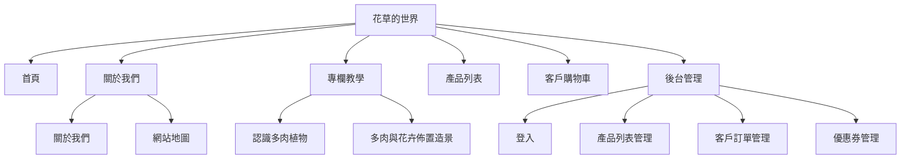

# React + Vite

This template provides a minimal setup to get React working in Vite with HMR and some ESLint rules.

Currently, two official plugins are available:

- [@vitejs/plugin-react](https://github.com/vitejs/vite-plugin-react/blob/main/packages/plugin-react) uses [Babel](https://babeljs.io/) (or [oxc](https://oxc.rs) when used in [rolldown-vite](https://vite.dev/guide/rolldown)) for Fast Refresh
- [@vitejs/plugin-react-swc](https://github.com/vitejs/vite-plugin-react/blob/main/packages/plugin-react-swc) uses [SWC](https://swc.rs/) for Fast Refresh

## React Compiler

The React Compiler is not enabled on this template because of its impact on dev & build performances. To add it, see [this documentation](https://react.dev/learn/react-compiler/installation).

## Expanding the ESLint configuration

If you are developing a production application, we recommend using TypeScript with type-aware lint rules enabled. Check out the [TS template](https://github.com/vitejs/vite/tree/main/packages/create-vite/template-react-ts) for information on how to integrate TypeScript and [`typescript-eslint`](https://typescript-eslint.io) in your project.

--- 
# 《花草的世界》專案提交說明（規劃／開發前階段）

> 本文件語境為 **專案尚未建置、尚未進入開發** 之交件用說明：以規劃與預計範圍為主，不宣稱已完成實作或部署。  

---

## 一、專案主題與目標

本專案為電商主題之「花草的世界」，聚焦花卉、多肉植物與空間造景相關商品與內容。目標是在單一網站內，讓一般使用者能依分類瀏覽商品、查看明細、加入購物車並完成訂購與付款流程；並規劃管理端，供營運人員維護商品、訂單與優惠活動。

---

## 二、使用者故事（摘要）

使用者可於網頁依分類篩選商品、查看產品明細，將商品加入購物車，填寫訂購與付款資訊後送出並完成交易。管理者可於後台檢視產品列表並進行編輯、管理客戶訂單，以及設定與管理優惠券。

---

## 三、規劃範圍

### 前台（規劃）

- 首頁與品牌內容
- 關於我們與網站地圖
- 專欄教學（例如多肉入門、造景規劃）
- 產品列表（單一路由、左側依商品分類動態篩選）
- 產品明細以彈窗呈現並可加入購物車
- 購物車與結帳（含訂購人資料、付款方式、確認送出）

### 後台（規劃）

- 管理員登入
- 產品列表與編輯（含上下架或啟用狀態）
- 訂單列表與狀態維護
- 優惠券之新增、編輯、啟用與刪除

### 網站地圖

---

## 四、介面與導覽（規劃原則）

規劃採主選單與子選單結構：部分區塊（如關於我們、專欄、後台）具子頁導覽；產品列表、購物車等以單頁完成主要操作。網站需考量 RWD，前台以行動裝置寬度可讀為目標；後台以桌面操作為主，表格區域可接受橫向捲動。

---

## 五、技術與架構

預定以 **React** 為前端框架技術，並使用 **Bootstrap** 建立響應式網站，搭配路由區分前台與後台；狀態管理與 API 呼叫將以模組化方式規劃，以利後續維護。實際套件版本、目錄結構與環境變數將於開發階段依課程／團隊規範定案。

---

## 六、驗收與成功標準（規劃）

- 前台可完成「瀏覽商品 → 購物車 → 填寫資料 → 送出／完成流程」之主要動線。
- 後台可完成商品、訂單、優惠券之基本維運。
- 各頁文案完整、非占位；產品資料量符合課程對電商主題之要求。
- 繳交物（Repo、可執行說明、部署連結等）依課程公告另行檢核。

---

## 七、假設與待開發階段確認事項

金流是否為模擬或正式串接、會員系統是否納入範圍、API 規格與權限細節，將於進入開發前依規格文件與後端／課程環境確認後定案。

---

## 附錄：提交摘要 

本專案「花草的世界」為花藝／多肉／造景主題之電商規劃案。前台預計提供首頁與品牌內容、關於我們與網站地圖、專欄教學、依分類篩選之產品列表與明細彈窗、購物車與結帳流程；後台預計提供登入後之產品、訂單與優惠券管理。技術面預定採 React 建置，並區分前後台路由，狀態與 API 以模組化設計以利維護。驗收以完整購物動線、後台維運能力、內容完整度及課程繳交規範為準；金流深度與會員範圍於開發前依環境與規格定案。

---

## 實作階段：需求／建議／問題記錄

新增需求、建議事項與問題修正之登錄格式與歷史條目見 [`1.docs/新增需求-建議及問題修正記錄.md`](./1.docs/新增需求-建議及問題修正記錄.md)。
